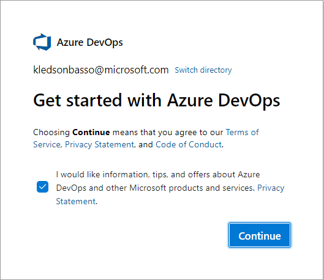
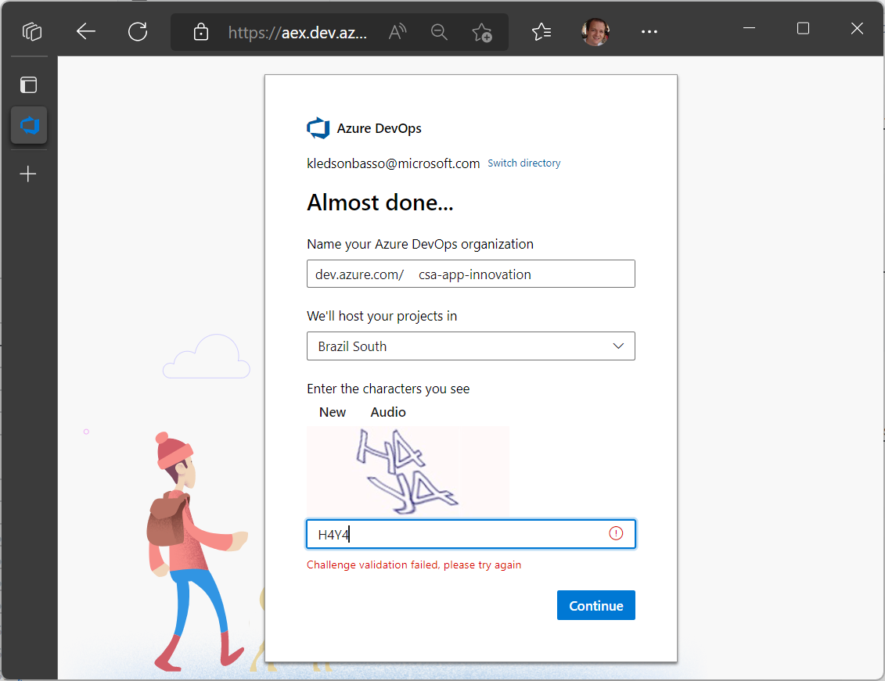
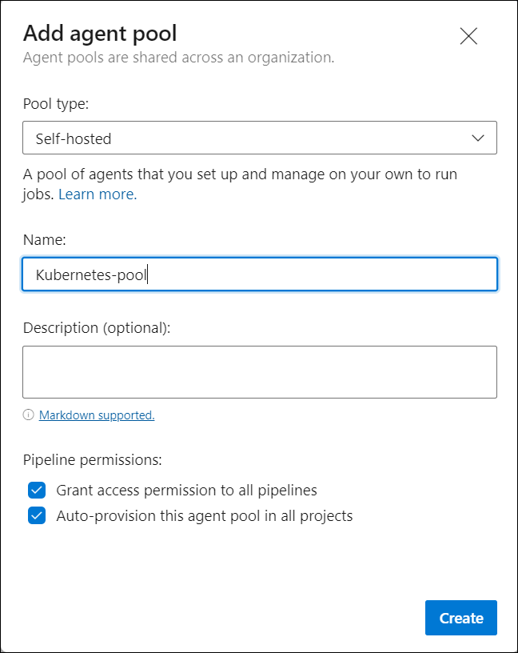
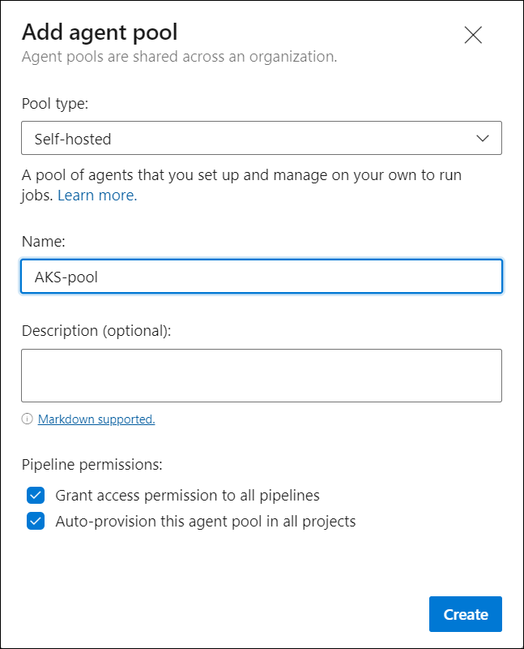

# Azure DevOps Self-hosted agents

An agent that you set up and manage on your own to run jobs is a self-hosted agent.

You can use self-hosted agents in Azure Pipelines.

Self-hosted agents give you more control to install dependent software needed for your builds and deployments.

<br><br>
## Sign up for [Azure Pipelines](https://learn.microsoft.com/en-us/azure/devops/pipelines/get-started/pipelines-sign-up?view=azure-devops)

Sign up for an Azure DevOps organization and Azure Pipelines to begin managing CI/CD to deploy your code. <br><br>

1. Log into [Azure DevOps](https://dev.azure.com/) using your Microsoft account.

   

2. Enter a name for your organization, select a host location from the drop-down menu, enter the characters you see, and then select **Continue**.

   

   > Use the following URL to sign in to your organization at any time: https://dev.azure.com/{yourorganization}

3. Enter a name for your project, select the visibility, and optionally provide a description. Then choose **Create project**.

   


<br><br>
## Create and manage [agent pools](https://learn.microsoft.com/en-us/azure/devops/pipelines/agents/pools-queues?view=azure-devops&tabs=yaml%2Cbrowser#create-agent-pools)

An agent pool is a collection of agents.

Instead of managing each agent individually, you organize agents into agent pools.

When you configure an agent, it is registered with a single pool, and when you create a pipeline, you specify the pool in which the pipeline runs.

When you run the pipeline, it runs on an agent from that pool that meets the demands of the pipeline.

In Azure Pipelines, pools are scoped to the entire organization, so you can share the agent machines across projects.

This article describes how to [Create the Azure DevOps Agent](https://learn.microsoft.com/en-us/azure/devops/pipelines/agents/pools-queues?view=azure-devops&tabs=yaml%2Cbrowser#create-agent-pools) (ADO) on different self-hosted targets.

- [Self-hosted agents on Docker](#self-hosted-agents-on-docker)
- [Self-hosted agents on Kubernetes](#self-hosted-agents-on-kubernetes)
- [Self-hosted agents on AKS](#self-hosted-agents-on-aks)


<br><br>
### Self-hosted agents on **Docker**

<details>
<summary>Expand for instructions</summary>

<br><br>
To be successful and get the most of this section, you are encouraged to have the [Docker Runtime](https://docs.docker.com/docker-for-windows/install/) ready.
<br><br>

1. Go to your organization and select **Organization settings**.

   

2. Select **Agent pools** in the left panel under **Pipelines**.

   

3. Select **Add pool**.

4. Select **Self-hosted** for **Pool type**, type **Docker-pool** as the **Name** of the agent pool and select **Create**.

   

5. Create in your machine a directory of your choice and navigate into it.

   > Picture for example only.

   

6. Save the following content to file **```Dockerfile```**.

   ```
   FROM ubuntu:20.04
   RUN DEBIAN_FRONTEND=noninteractive apt-get update
   RUN DEBIAN_FRONTEND=noninteractive apt-get upgrade -y

   RUN DEBIAN_FRONTEND=noninteractive apt-get install -y -qq --no-install-recommends \
       apt-transport-https \
       apt-utils \
       ca-certificates \
       curl \
       git \
       iputils-ping \
       jq \
       lsb-release \
       software-properties-common

   RUN curl -sL https://aka.ms/InstallAzureCLIDeb | bash

   # Can be 'linux-x64', 'linux-arm64', 'linux-arm', 'rhel.6-x64'.
   ENV TARGETARCH=linux-x64

   WORKDIR /azp

   COPY ./start.sh .
   RUN chmod +x start.sh

   ENTRYPOINT [ "./start.sh" ]
   ```

7. Save the following content to file **```start.sh```**.

   ```
   #!/bin/bash
   set -e

   if [ -z "$AZP_URL" ]; then
       echo 1>&2 "error: missing AZP_URL environment variable"
       exit 1
   fi

   if [ -z "$AZP_TOKEN_FILE" ]; then
       if [ -z "$AZP_TOKEN" ]; then
           echo 1>&2 "error: missing AZP_TOKEN environment variable"
           exit 1
       fi

       AZP_TOKEN_FILE=/azp/.token
       echo -n $AZP_TOKEN > "$AZP_TOKEN_FILE"
   fi

   unset AZP_TOKEN

   if [ -n "$AZP_WORK" ]; then
       mkdir -p "$AZP_WORK"
   fi

   export AGENT_ALLOW_RUNASROOT="1"

   cleanup() {
       if [ -e config.sh ]; then
           print_header "Cleanup. Removing Azure Pipelines agent..."

           # If the agent has some running jobs, the configuration removal process will fail.
           # So, give it some time to finish the job.
           while true; do
               ./config.sh remove --unattended --auth PAT --token $(cat "$AZP_TOKEN_FILE") && break

               echo "Retrying in 30 seconds..."
               sleep 30
           done
       fi
   }

   print_header() {
       lightcyan='\033[1;36m'
       nocolor='\033[0m'
       echo -e "${lightcyan}$1${nocolor}"
   }

   # Let the agent ignore the token env variables
   export VSO_AGENT_IGNORE=AZP_TOKEN,AZP_TOKEN_FILE

   print_header "1. Determining matching Azure Pipelines agent..."

   AZP_AGENT_PACKAGES=$(curl -LsS \
       -u user:$(cat "$AZP_TOKEN_FILE") \
       -H 'Accept:application/json;' \
       "$AZP_URL/_apis/distributedtask/packages/agent?platform=$TARGETARCH&top=1")

   AZP_AGENT_PACKAGE_LATEST_URL=$(echo "$AZP_AGENT_PACKAGES" | jq -r '.value[0].downloadUrl')

   if [ -z "$AZP_AGENT_PACKAGE_LATEST_URL" -o "$AZP_AGENT_PACKAGE_LATEST_URL" == "null" ]; then
       echo 1>&2 "error: could not determine a matching Azure Pipelines agent"
       echo 1>&2 "check that account '$AZP_URL' is correct and the token is valid for that account"
       exit 1
   fi

   print_header "2. Downloading and extracting Azure Pipelines agent..."

   curl -LsS $AZP_AGENT_PACKAGE_LATEST_URL | tar -xz & wait $!

   source ./env.sh

   print_header "3. Configuring Azure Pipelines agent..."

   ./config.sh --unattended \
       --agent "${AZP_AGENT_NAME:-$(hostname)}" \
       --url "$AZP_URL" \
       --auth PAT \
       --token $(cat "$AZP_TOKEN_FILE") \
       --pool "${AZP_POOL:-Default}" \
       --work "${AZP_WORK:-_work}" \
       --replace \
       --acceptTeeEula & wait $!

   print_header "4. Running Azure Pipelines agent..."

   trap 'cleanup; exit 0' EXIT
   trap 'cleanup; exit 130' INT
   trap 'cleanup; exit 143' TERM

   chmod +x ./run-docker.sh

   # To be aware of TERM and INT signals call run.sh
   # Running it with the --once flag at the end will shut down the agent after the build is executed
   ./run-docker.sh "$@" & wait $!
   ```

8. Build the container and push it into a Container Registry repository of your choice.

   ```console
   docker build -t kledsonhugo/adoagent:latest .
   docker push kledsonhugo/adoagent:latest
   ```

   > **Warning**

   > Replace ```kledsonhugo``` by your Container Registry account.

9. Run the container.

   ```console
   docker run \
       -e AZP_URL=$AZP_URL \
       -e AZP_TOKEN=$AZP_TOKEN \
       -e AZP_POOL=Docker-pool \
       kledsonhugo/adoagent:latest
   ```

   > **Warning**

   > You need replace ```$AZP_URL``` and ```$AZP_TOKEN``` with your ADO url and token.

   > Replace ```kledsonhugo``` by your Container Registry account.

   | Env Var | Description |
   |----------|---------------|
   | `AZP_URL` | The URL of the Azure DevOps or Azure DevOps Server instance. |
   | `AZP_TOKEN` | [Personal Access Token](https://learn.microsoft.com/en-us/azure/devops/organizations/accounts/use-personal-access-tokens-to-authenticate?view=azure-devops&amp%3Btabs=Windows&tabs=Windows) (PAT) with Agent Pools (read, manage) scope, created by a user who has permission to configure agents, at AZP_URL. |

10. Go to your **Organization settings**, select **Agent pools** and select **Docker-pool**.

11. You should now see your Docker containers connected in the **Agents** menu.

    

    > You can run multiple containers in paralel as you want. In the picture there are 2 running as example.

</details>

<br><br>
### Self-hosted agents on **Kubernetes**

<details>
<summary>Expand for instructions</summary>

<br><br>
A [Kubernetes](https://kubernetes.io/docs/tasks/tools/) active software is required to perform this setion.
<br><br>

1. Go to your organization and select **Organization settings**.

   

2. Select **Agent pools** in the left panel under **Pipelines**.

   

3. Select **Add pool**.

4. Select **Self-hosted** for **Pool type**, type **Kubernetes-pool** as the **Name** of the agent pool and select **Create**.

   

5. Create in your machine a directory of your choice and navigate into it.

   > Picture for example only.

   

6. Save the following content to file **```Dockerfile```**.

   ```
   FROM ubuntu:20.04
   RUN DEBIAN_FRONTEND=noninteractive apt-get update
   RUN DEBIAN_FRONTEND=noninteractive apt-get upgrade -y

   RUN DEBIAN_FRONTEND=noninteractive apt-get install -y -qq --no-install-recommends \
       apt-transport-https \
       apt-utils \
       ca-certificates \
       curl \
       git \
       iputils-ping \
       jq \
       lsb-release \
       software-properties-common

   RUN curl -sL https://aka.ms/InstallAzureCLIDeb | bash

   # Can be 'linux-x64', 'linux-arm64', 'linux-arm', 'rhel.6-x64'.
   ENV TARGETARCH=linux-x64

   WORKDIR /azp

   COPY ./start.sh .
   RUN chmod +x start.sh

   ENTRYPOINT [ "./start.sh" ]
   ```

7. Save the following content to file **```start.sh```**.

   ```
   #!/bin/bash
   set -e

   if [ -z "$AZP_URL" ]; then
       echo 1>&2 "error: missing AZP_URL environment variable"
       exit 1
   fi

   if [ -z "$AZP_TOKEN_FILE" ]; then
       if [ -z "$AZP_TOKEN" ]; then
           echo 1>&2 "error: missing AZP_TOKEN environment variable"
           exit 1
       fi

       AZP_TOKEN_FILE=/azp/.token
       echo -n $AZP_TOKEN > "$AZP_TOKEN_FILE"
   fi

   unset AZP_TOKEN

   if [ -n "$AZP_WORK" ]; then
       mkdir -p "$AZP_WORK"
   fi

   export AGENT_ALLOW_RUNASROOT="1"

   cleanup() {
       if [ -e config.sh ]; then
           print_header "Cleanup. Removing Azure Pipelines agent..."

           # If the agent has some running jobs, the configuration removal process will fail.
           # So, give it some time to finish the job.
           while true; do
               ./config.sh remove --unattended --auth PAT --token $(cat "$AZP_TOKEN_FILE") && break

               echo "Retrying in 30 seconds..."
               sleep 30
           done
       fi
   }

   print_header() {
       lightcyan='\033[1;36m'
       nocolor='\033[0m'
       echo -e "${lightcyan}$1${nocolor}"
   }

   # Let the agent ignore the token env variables
   export VSO_AGENT_IGNORE=AZP_TOKEN,AZP_TOKEN_FILE

   print_header "1. Determining matching Azure Pipelines agent..."

   AZP_AGENT_PACKAGES=$(curl -LsS \
       -u user:$(cat "$AZP_TOKEN_FILE") \
       -H 'Accept:application/json;' \
       "$AZP_URL/_apis/distributedtask/packages/agent?platform=$TARGETARCH&top=1")

   AZP_AGENT_PACKAGE_LATEST_URL=$(echo "$AZP_AGENT_PACKAGES" | jq -r '.value[0].downloadUrl')

   if [ -z "$AZP_AGENT_PACKAGE_LATEST_URL" -o "$AZP_AGENT_PACKAGE_LATEST_URL" == "null" ]; then
       echo 1>&2 "error: could not determine a matching Azure Pipelines agent"
       echo 1>&2 "check that account '$AZP_URL' is correct and the token is valid for that account"
       exit 1
   fi

   print_header "2. Downloading and extracting Azure Pipelines agent..."

   curl -LsS $AZP_AGENT_PACKAGE_LATEST_URL | tar -xz & wait $!

   source ./env.sh

   print_header "3. Configuring Azure Pipelines agent..."

   ./config.sh --unattended \
       --agent "${AZP_AGENT_NAME:-$(hostname)}" \
       --url "$AZP_URL" \
       --auth PAT \
       --token $(cat "$AZP_TOKEN_FILE") \
       --pool "${AZP_POOL:-Default}" \
       --work "${AZP_WORK:-_work}" \
       --replace \
       --acceptTeeEula & wait $!

   print_header "4. Running Azure Pipelines agent..."

   trap 'cleanup; exit 0' EXIT
   trap 'cleanup; exit 130' INT
   trap 'cleanup; exit 143' TERM

   chmod +x ./run-docker.sh

   # To be aware of TERM and INT signals call run.sh
   # Running it with the --once flag at the end will shut down the agent after the build is executed
   ./run-docker.sh "$@" & wait $!
   ```

8. Build the container and push it into a Container Registry repository of your choice.

   ```console
   docker build -t kledsonhugo/adoagent:latest .
   docker push kledsonhugo/adoagent:latest
   ```

   > **Warning**

   > Replace ```kledsonhugo``` by your Container Registry account.

9. Save the following content to file **```deployment.yml```**.

   ```
   apiVersion: apps/v1
   kind: Deployment
   metadata:
   name: adoagent-deployment
   spec:
   selector:
       matchLabels:
       app: adoagent
   replicas: 2
   template:
       metadata:
       labels:
           app: adoagent
       spec:
       containers:
       - name: adoagent
           image: kledsonhugo/adoagent:latest
           env:
           - name: AZP_URL
             value: https://dev.azure.com/csu-csa-appinnovation
           - name: AZP_TOKEN
             value: XXXXXXXXXXXXXXXXXXXXXXXXXXXXX
           - name: AZP_POOL
             value: Kubernetes-pool
   ```

   > **Warning**

   > You need replace values for vars ```AZP_URL``` and ```AZP_TOKEN``` with your ADO url and token.

   > Replace ```kledsonhugo``` by your Container Registry account.

   | Env Var | Description |
   |----------|---------------|
   | `AZP_URL` | The URL of the Azure DevOps or Azure DevOps Server instance. |
   | `AZP_TOKEN` | [Personal Access Token](https://learn.microsoft.com/en-us/azure/devops/organizations/accounts/use-personal-access-tokens-to-authenticate?view=azure-devops&amp%3Btabs=Windows&tabs=Windows) (PAT) with Agent Pools (read, manage) scope, created by a user who has permission to configure agents, at AZP_URL. |

10. Deploy the Kubernetes pods.

    ```console
    kubectl apply -f deployment.yml
    ```

11. Validate if the Kubernetes pods are running with command ```kubectl get pods -o wide```.

    

12. Go to your **Organization settings**, select **Agent pools** and select **Kubernetes-pool**.

13. You should now see your Kubernetes pods connected in the **Agents** menu.

    

    > You can run multiple pods as you want. In the picture there are 2 online as example only.

</details>

<br><br>
### Self-hosted agents on **AKS**

<details>
<summary>Expand for instructions</summary>

<br><br>
The [Azure Command-Line Interface (CLI)](https://learn.microsoft.com/en-us/cli/azure/what-is-azure-cli) is required to perform this section.
<br><br>

1. Go to your organization and select **Organization settings**.

   

2. Select **Agent pools** in the left panel under **Pipelines**.

   

3. Select **Add pool**.

4. Select **Self-hosted** for **Pool type**, type **AKS-pool** as the **Name** of the agent pool and select **Create**.

   

5. Create in your machine a directory of your choice and navigate into it.

   > Picture for example only.

   

6. Save the following content to file **```Dockerfile```**.

   ```
   FROM ubuntu:20.04
   RUN DEBIAN_FRONTEND=noninteractive apt-get update
   RUN DEBIAN_FRONTEND=noninteractive apt-get upgrade -y

   RUN DEBIAN_FRONTEND=noninteractive apt-get install -y -qq --no-install-recommends \
       apt-transport-https \
       apt-utils \
       ca-certificates \
       curl \
       git \
       iputils-ping \
       jq \
       lsb-release \
       software-properties-common

   RUN curl -sL https://aka.ms/InstallAzureCLIDeb | bash

   # Can be 'linux-x64', 'linux-arm64', 'linux-arm', 'rhel.6-x64'.
   ENV TARGETARCH=linux-x64

   WORKDIR /azp

   COPY ./start.sh .
   RUN chmod +x start.sh

   ENTRYPOINT [ "./start.sh" ]
   ```

7. Save the following content to file **```start.sh```**.

   ```
   #!/bin/bash
   set -e

   if [ -z "$AZP_URL" ]; then
       echo 1>&2 "error: missing AZP_URL environment variable"
       exit 1
   fi

   if [ -z "$AZP_TOKEN_FILE" ]; then
       if [ -z "$AZP_TOKEN" ]; then
           echo 1>&2 "error: missing AZP_TOKEN environment variable"
           exit 1
       fi

       AZP_TOKEN_FILE=/azp/.token
       echo -n $AZP_TOKEN > "$AZP_TOKEN_FILE"
   fi

   unset AZP_TOKEN

   if [ -n "$AZP_WORK" ]; then
       mkdir -p "$AZP_WORK"
   fi

   export AGENT_ALLOW_RUNASROOT="1"

   cleanup() {
       if [ -e config.sh ]; then
           print_header "Cleanup. Removing Azure Pipelines agent..."

           # If the agent has some running jobs, the configuration removal process will fail.
           # So, give it some time to finish the job.
           while true; do
           ./config.sh remove --unattended --auth PAT --token $(cat "$AZP_TOKEN_FILE") && break

           echo "Retrying in 30 seconds..."
           sleep 30
           done
       fi
   }

   print_header() {
       lightcyan='\033[1;36m'
       nocolor='\033[0m'
       echo -e "${lightcyan}$1${nocolor}"
   }

   # Let the agent ignore the token env variables
   export VSO_AGENT_IGNORE=AZP_TOKEN,AZP_TOKEN_FILE

   print_header "1. Determining matching Azure Pipelines agent..."

   AZP_AGENT_PACKAGES=$(curl -LsS \
       -u user:$(cat "$AZP_TOKEN_FILE") \
       -H 'Accept:application/json;' \
       "$AZP_URL/_apis/distributedtask/packages/agent?platform=$TARGETARCH&top=1")

   AZP_AGENT_PACKAGE_LATEST_URL=$(echo "$AZP_AGENT_PACKAGES" | jq -r '.value[0].downloadUrl')

   if [ -z "$AZP_AGENT_PACKAGE_LATEST_URL" -o "$AZP_AGENT_PACKAGE_LATEST_URL" == "null" ]; then
       echo 1>&2 "error: could not determine a matching Azure Pipelines agent"
       echo 1>&2 "check that account '$AZP_URL' is correct and the token is valid for that account"
       exit 1
   fi

   print_header "2. Downloading and extracting Azure Pipelines agent..."

   curl -LsS $AZP_AGENT_PACKAGE_LATEST_URL | tar -xz & wait $!

   source ./env.sh

   print_header "3. Configuring Azure Pipelines agent..."

   ./config.sh --unattended \
       --agent "${AZP_AGENT_NAME:-$(hostname)}" \
       --url "$AZP_URL" \
       --auth PAT \
       --token $(cat "$AZP_TOKEN_FILE") \
       --pool "${AZP_POOL:-Default}" \
       --work "${AZP_WORK:-_work}" \
       --replace \
       --acceptTeeEula & wait $!

   print_header "4. Running Azure Pipelines agent..."

   trap 'cleanup; exit 0' EXIT
   trap 'cleanup; exit 130' INT
   trap 'cleanup; exit 143' TERM

   chmod +x ./run-docker.sh

   # To be aware of TERM and INT signals call run.sh
   # Running it with the --once flag at the end will shut down the agent after the build is executed
   ./run-docker.sh "$@" & wait $!
   ```

8. Deploy and configure Azure Kubernetes Service (AKS).

   > Follow the steps in [Quickstart: Deploy an Azure Kubernetes Service (AKS) cluster](https://learn.microsoft.com/en-us/azure/container-registry/container-registry-get-started-portal).

9. Deploy and configure Azure Container Registry.

   > Follow the steps in [Quickstart: Create an Azure container registry](https://learn.microsoft.com/en-us/azure/container-registry/container-registry-get-started-portal).

   > After this, you can push and pull containers from Azure Container Registry.

10. Build the container and push it into a Container Registry repository of your choice.

    ```console
    docker build -t akspoolacr.azurecr.io/adoagent:latest .
    docker push akspoolacr.azurecr.io/adoagent:latest
    ```

    > **Warning**

    > Replace ```akspoolacr.azurecr.io``` by your Container Registry account and ensure you are logged to the Container registry.

11. Save the following content to file **```deployment.yml```**.

    ```
    apiVersion: apps/v1
    kind: Deployment
    metadata:
    name: adoagent-deployment
    spec:
    selector:
        matchLabels:
        app: adoagent
    replicas: 2
    template:
        metadata:
        labels:
            app: adoagent
        spec:
        containers:
        - name: adoagent
            image: akspoolacr.azurecr.io/adoagent:latest
            env:
            - name: AZP_URL
              value: https://dev.azure.com/csu-csa-appinnovation
            - name: AZP_TOKEN
              value: XXXXXXXXXXXXXXXXXXXXXXXXXXXXX
            - name: AZP_POOL
              value: AKS-pool
    ```

    > **Warning**

    > You need replace values for vars ```AZP_URL``` and ```AZP_TOKEN``` with your ADO url and token.

    > Replace ```akspoolacr.azurecr.io``` by your Container Registry account.

    | Env Var | Description |
    |----------|---------------|
    | `AZP_URL` | The URL of the Azure DevOps or Azure DevOps Server instance. |
    | `AZP_TOKEN` | [Personal Access Token](https://learn.microsoft.com/en-us/azure/devops/organizations/accounts/use-personal-access-tokens-to-authenticate?view=azure-devops&amp%3Btabs=Windows&tabs=Windows) (PAT) with Agent Pools (read, manage) scope, created by a user who has permission to configure agents, at AZP_URL. |

12. Connect to your AKS cluster.

    ```console
    az account set --subscription $AZ_SUBSCRIPTION_ID
    az aks get-credentials --resource-group $AZ_AKS_CLUSTER --name $AZ_AKS_CLUSTER
    ```

    > **Warning**

    > You need replace ```$AZ_SUBSCRIPTION_ID```, ```$AZ_AKS_CLUSTER```  and ```$AZ_AKS_CLUSTER``` with your proper values.

13. Deploy the AKS pods.

    ```console
    kubectl apply -f deployment.yml
    ```

14. Validate if the AKS pods are running with command ```kubectl get pods -o wide```.

    

15. Go to your **Organization settings**, select **Agent pools** and select **AKS-pool**.

16. You should now see your AKS pods connected in the **Agents** menu.

    

    > You can run multiple pods as you want. In the picture there are 2 online as example only.

</details>

<br><br>
## Create project pipeline for Self-hosted agents

Microsoft Learn allows [Create a build pipeline with Azure Pipelines](https://learn.microsoft.com/en-us/training/modules/create-a-build-pipeline/?view=azure-devops) for good understanding of Azure DevOps Pipelines. It is very recommended prior to proceed.<br><br>

1. Go to your organization and select a project.

2. Select **Repos** in the left panel and ensure there is a branch. Visit [The pipeline default branch](https://learn.microsoft.com/en-us/azure/devops/pipelines/process/pipeline-default-branch?view=azure-devops) in case of questions.

3. Select **Pipelines** in the left panel and then **Create pipeline**.

4. Select **Use the classic editor to create a pipeline without YAML** then **Continue**.

5. Select **Empty pipeline** then **Apply**.

6. Select **Kubernetes-pool** for **Agent pool**, click the plus signal on **Agent job 1** and select **Command line**. In the **Triggers** menu, select **Enable continuous integration**, then click **Save & queue**.

   

   

7. Type a comment and select **Save and run**.

8. The pipeline should complete and you receive an e-mail.

   

9. **Congratulations !!!**

   You could make an overview of Azure DevOps self-hosted agents on Kubernetes.
   
   Try configuring the same for all target self-hosted agent technologies described on this procedure.