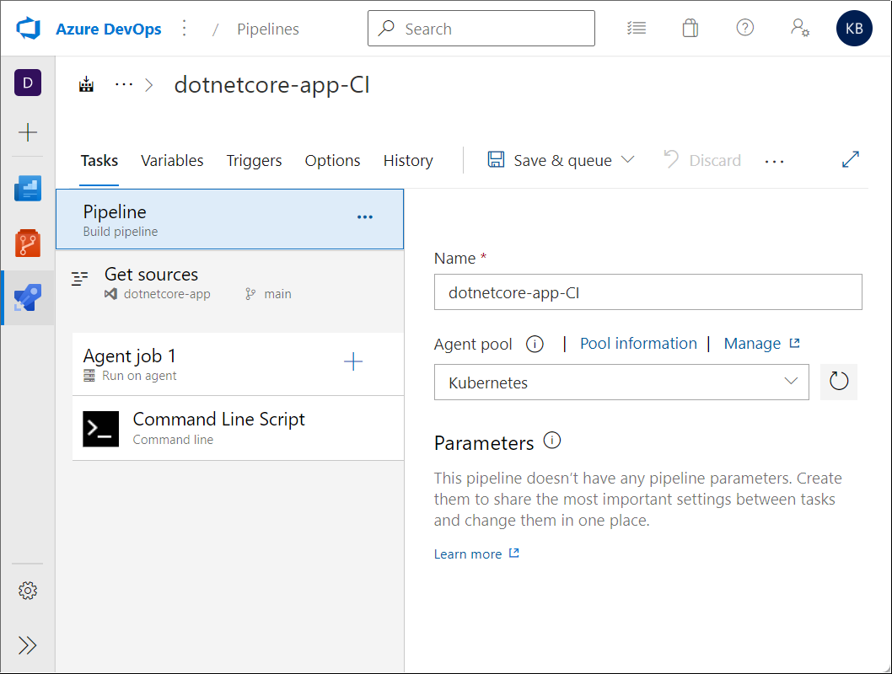
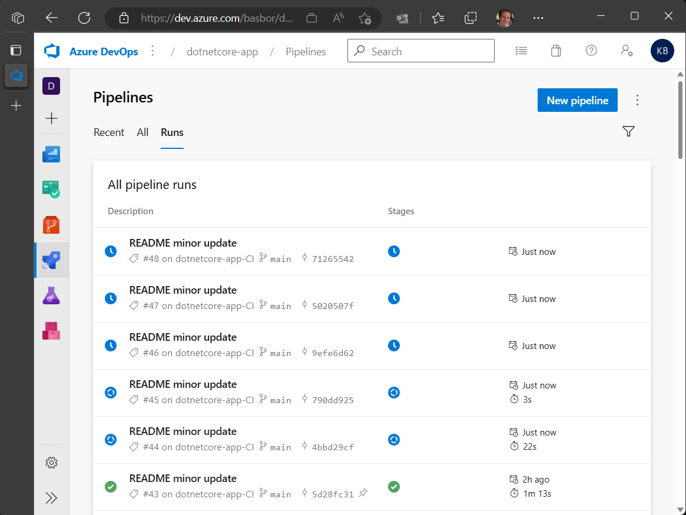

# **Azure DevOps Self-hosted agents**

An agent that you set up and manage on your own to run Azure DevOps pipeline jobs.

Self-hosted agents give you more control to install dependent software needed for your builds and deployments.

- [Sign up for Azure Pipelines](#sign-up-for-azure-pipelines)
- [Create Agent Pools](#create-agent-pools)
- [Setup Pipeline for Self-hosted agents](#setup-pipeline-for-self-hosted-agents)
- [Auto-scaling Self-hosted agents using KEDA](#auto-scaling-self-hosted-agents-using-KEDA)

<br>

Desired architecture where Azure Kubernetes Service is hosting the Azure DevOps Self-hosted agents layer and Azure Kubernetes Service is hosting the infrastructure layer of the target company workload.


<br>

## **Sign up for [Azure Pipelines](https://learn.microsoft.com/en-us/azure/devops/pipelines/get-started/pipelines-sign-up?view=azure-devops)**

1. Log into [Azure DevOps](https://dev.azure.com/) using your account.

   > **Note**: Sign up for an Azure DevOps organization to begin managing CI/CD to deploy your code.

2. Enter a name for your organization, select a host location from the drop-down menu, enter the characters you see, and then select **Continue**.

   > **Note**: Use https://dev.azure.com/{yourorganization} to sign in to your organization at any time.

3. Enter a name for your project, select the visibility, and optionally provide a description. Then choose **Create project**.

<br>

## **Create [Agent Pools](https://learn.microsoft.com/en-us/azure/devops/pipelines/agents/pools-queues?view=azure-devops&tabs=yaml%2Cbrowser#create-agent-pools)**

An agent pool is a collection of agents.

Instead of managing each agent individually, you organize agents into agent pools.

When you configure an agent, it is registered with a single pool, and when you create a pipeline, you specify the pool in which the pipeline runs.

When you run the pipeline, it runs on an agent from that pool that meets the demands of the pipeline.

In Azure Pipelines, pools are scoped to the entire organization, so you can share the agent machines across projects.

This article describes how to [Create the Azure DevOps Self-hosted Agent](https://learn.microsoft.com/en-us/azure/devops/pipelines/agents/pools-queues?view=azure-devops&tabs=yaml%2Cbrowser#create-agent-pools) on different container platforms.

- [Self-hosted agents on Azure Container Instances](#self-hosted-agents-on-azure-container-instances)
- [Self-hosted agents on Azure Kubernetes Service](#self-hosted-agents-on-azure-kubernetes-service)
- [Self-hosted agents on Azure Container Apps](#self-hosted-agents-on-azure-container-apps)

### Self-hosted agents on **Azure Container Instances**

<details>
<summary>Expand for instructions</summary>

1. Go to your organization and select **Organization settings**.

2. Select **Agent pools** in the left panel under **Pipelines**.

3. Select **Add pool**.

4. Select **Self-hosted** for **Pool type**, type the name of your pool (e.g. **ACI-pool**) and select **Create**.

5. Deploy and configure Azure Container Registry, in case you don't have one.

   > **Note**: Follow instructions from [Quickstart: Create an Azure container registry](https://learn.microsoft.com/en-us/azure/container-registry/container-registry-get-started-portal). After this, you can push and pull containers from Azure Container Registry.

6. Create in your machine a work directory of your choice and navigate into it.

7. Download files [``Dockerfile``](/adoagent/Dockerfile) and [``start.sh``](/adoagent/start.sh) and save them in your work directory.

8. Build the Azure Devops Self-hosted container based on your needs (tools, frameworks, etc) and push it into tour Container Registry repository.

   > **Note**: Replace ``[your registry]`` by your Container Registry account and ensure you are logged to the Container registry.

   ```console
   docker build -t [your registry]/adoagent:latest .
   docker push [your registry]/adoagent:latest
   ```

9. Download file [``azdevops-apps.yaml``](/ACI/azdevops-apps.yaml) and save it in your work directory.

   > **Note**: Replace values for vars ```location```, ```name```, ```image```, ```AZP_URL```, ```AZP_TOKEN```, ```AZP_POOL``` and ```'imageRegistryCredentials``` with your proper values.

   | Env Var | Description |
   |----------|---------------|
   | `AZP_URL` | The URL of the Azure DevOps or Azure DevOps Server instance. |
   | `AZP_TOKEN` | [Personal Access Token](https://learn.microsoft.com/en-us/azure/devops/organizations/accounts/use-personal-access-tokens-to-authenticate?view=azure-devops&amp%3Btabs=Windows&tabs=Windows) (PAT) with Agent Pools (read, manage) scope, created by a user who has permission to configure agents, at AZP_URL. |

10. Deploy the ACI container.

    > **Note**: Ensure your Azure Resource Group is created. Replace ``[resource group]`` and ``[your namespace]`` with your own values.

    ```console
    az container create \
      --resource-group [your resource group] \
      --file azdevops-apps.yml
      --namespace [your namespace]
    ```

11. Go to your **Organization settings**, select **Agent pools** and select the related **ACI** agent pool.

12. You should now see your ACI container instance connected in the **Agents** menu.

    > **Note**: You can run multiple ACI container instances using Container Groups. See [Tutorial: Deploy a multi-container group using Docker Compose](https://learn.microsoft.com/en-us/azure/container-instances/tutorial-docker-compose) for details.

    

</details>

### Self-hosted agents on **Azure Kubernetes Services**

<details>
<summary>Expand for instructions</summary>

1. Go to your organization and select **Organization settings**.

2. Select **Agent pools** in the left panel under **Pipelines**.

3. Select **Add pool**.

4. Select **Self-hosted** for **Pool type**, type the name of your pool (e.g. **AKS-pool**) and select **Create**.

5. Deploy and configure Azure Container Registry, in case you don't have one.

   > **Note**: Follow instructions from [Quickstart: Create an Azure container registry](https://learn.microsoft.com/en-us/azure/container-registry/container-registry-get-started-portal). After this, you can push and pull containers from Azure Container Registry.

6. Create in your machine a work directory of your choice and navigate into it.

7. Download files [``Dockerfile``](/adoagent/Dockerfile) and [``start.sh``](/adoagent/start.sh) and save them in your work directory.

8. Build the Azure Devops Self-hosted container based on your needs (tools, frameworks, etc) and push it into tour Container Registry repository.

   > **Note**: Replace ``[your registry]`` by your Container Registry account and ensure you are logged to the Container registry.

   ```console
   docker build -t [your registry]/adoagent:latest .
   docker push [your registry]/adoagent:latest
   ```

9. Deploy and configure Azure Kubernetes Service (AKS).

   > **Note**: Setup the AKS cluster based on your needs. In a public subnet, in a private subnet, etc. There are multiple choices you can select. Ensure you have all requirements satisfied, or just create an AKS cluster based on the [AKS Quickstart guide](https://learn.microsoft.com/en-us/azure/aks/learn/quick-kubernetes-deploy-cli).

10. Download the manifest [``azdevops-apps.yaml``](/ACI/azdevops-apps.yaml) and save it in your work directory.

    > **Note**: Replace values for vars ```location```, ```name```, ```image```, ```AZP_URL```, ```AZP_TOKEN```, ```AZP_POOL``` and ```'imageRegistryCredentials``` with your proper values.

    | Env Var | Description |
    |----------|---------------|
    | `AZP_URL` | The URL of the Azure DevOps or Azure DevOps Server instance. |
    | `AZP_TOKEN` | [Personal Access Token](https://learn.microsoft.com/en-us/azure/devops/organizations/accounts/use-personal-access-tokens-to-authenticate?view=azure-devops&amp%3Btabs=Windows&tabs=Windows) (PAT) with Agent Pools (read, manage) scope, created by a user who has permission to configure agents, at AZP_URL. |

11. Connect to your AKS cluster and deploy the manifest.

    > **Note**: Ensure your Azure Resource Group and AKS namespace are created. Replace ``[your subscription id]``, ``[your resource group]``,  ``[your AKS cluster]`` and ``[your namespace]`` with your own values.

    ```console
    az account set --subscription [your subscription id]
    az aks get-credentials --resource-group [your resource group] --name [your AKS cluster]
    kubectl apply -f azdevops-apps.yml -n [your namespace]
    ```

12. Go to your **Organization settings**, select **Agent pools** and select the related **AKS** agent pool.

13. You should now see your AKS pod instances connected in the **Agents** menu.

    > **Note**: You can run multiple pods as you want. In the picture there are 2 online as example only.

    

</details>

### Self-hosted agents on **Azure Container Apps**

<details>
<summary>Expand for instructions</summary>

1. Go to your organization and select **Organization settings**.

2. Select **Agent pools** in the left panel under **Pipelines**.

3. Select **Add pool**.

4. Select **Self-hosted** for **Pool type**, type the name of your pool (e.g. **ACA-pool**) and select **Create**.

5. Deploy and configure Azure Container Registry, in case you don't have one.

   > **Note**: Follow instructions from [Quickstart: Create an Azure container registry](https://learn.microsoft.com/en-us/azure/container-registry/container-registry-get-started-portal). After this, you can push and pull containers from Azure Container Registry.

6. Create in your machine a work directory of your choice and navigate into it.

7. Download files [``Dockerfile``](/adoagent/Dockerfile) and [``start.sh``](/adoagent/start.sh) and save them in your work directory.

8. Build the Azure Devops Self-hosted container based on your needs (tools, frameworks, etc) and push it into tour Container Registry repository.

   > **Note**: Replace ``[your registry]`` by your Container Registry account and ensure you are logged to the Container registry.

   ```console
   docker build -t [your registry]/adoagent:latest .
   docker push [your registry]/adoagent:latest
   ```

9. Deploy your Azure Container Apps instance.

    > **Note**: Below a deployment example. Ensure your Azure Resource Group is created. Replace ``[your ACA name]``, ``[your resource group]``, ``[your azure region]``, ``[your registry]``, ``[your ACA environment]``, ``[your registry user name]``, ``[your registry user password]``, ``[your personal access token]``, ``[your Azure organization]`` and ``[your Azure DevOps agent pool]`` with your own values. Follow the steps in [Quickstart: Deploy an existing container image with the command line](https://learn.microsoft.com/en-us/azure/container-apps/get-started-existing-container-image?tabs=bash&pivots=container-apps-private-registry) or check service docs for additional configuration options.

    ```console
    az containerapp env create \
    --name [your ACA environment] \
    --resource-group [your resource group] \
    --location [your azure region]

    az containerapp create \
    --name [your ACA name] \
    --resource-group [your resource group] \
    --image [your registry]/adoagent:latest \
    --environment [your ACA environment] \
    --registry-server [your registry] \
    --registry-username [your registry user name] \
    --registry-password [your registry user password] \
    --min-replicas 1 \
    --max-replicas 5 \
    --secrets 'azptoken=[your personal access token]' \
    --env-vars \
        'AZP_URL=https://dev.azure.com/[your Azure organization]' \
        'AZP_TOKEN=secretref:azptoken' \
        'AZP_POOL=[your Azure DevOps agent pool]'
    ```

10. Go to your **Organization settings**, select **Agent pools** and select the related **ACA** agent pool.

11. You should now see your Azure Container Apps containers connected in the **Agents** menu, as the example below.

    > **Note**: You can run multiple pods as you want. In the picture there are 2 online as example only.

</details>

## **Setup Pipeline for [Self-hosted agents](https://learn.microsoft.com/en-us/azure/devops/pipelines/agents/v2-linux?view=azure-devops)**

1. Go to your organization and select an existent project.

2. Select **Pipelines** in the left panel and then **Create pipeline**.

3. Select **Use the classic editor to create a pipeline without YAML** then **Continue**.

   > **Note**: In this article we are using the classic editor for exercise. You can select any other based on your real scenario. The next steps are based on the classic editor option.

4. Select **Empty pipeline** then **Apply**.

5. Select the Self-hosted agent pool previously created (e.g. Kubernetes), click the plus signal on **Agent job 1** and select **Command line**.

   

6. In the **Triggers** menu, select **Enable continuous integration**, then click **Save & queue**, type a comment and select **Save and run**.

   

8. The pipeline should complete and you receive an e-mail.

<br>

## **Auto-scaling Self-hosted agents using [KEDA](https://keda.sh/docs/2.3/scalers/azure-pipelines/)**

With the addition of Azure Piplines support in [KEDA](https://keda.sh/docs/2.3/scalers/azure-pipelines/), it is possible to autoscale your Self-hosted agents based on agent pool queue length.

In this section I am going to use KEDA to create Self-hosted scalable Azure DevOps agents deployed on different container services, like Azure Kubernetes Service (AKS), Azure Container Apps (ACA), etc.

- [Auto-scaling Self-hosted agents on Azure Kubernetes Service with KEDA](#auto-scaling-self-hosted-agents-on-azure-kubernetes-service-with-KEDA)
- [Auto-scaling Self-hosted agents on Azure Container Apps with KEDA](#auto-scaling-self-hosted-agents-on-azure-container-apps-with-KEDA)

### Auto-scaling Self-hosted agents on **Azure Kubernetes Service** with **KEDA**

<details>
<summary>Expand for instructions</summary>

1. Setup **KEDA** into your AKS cluster according to procedure [Deploying KEDA](https://keda.sh/docs/latest/deploy/).

   > **Note**: [Self-hosted agents on AKS](#self-hosted-agents-on-aks) is required for this step.

2. Download manifest [``azdevops-keda.yml``](/AKS/azdevops-keda.yml) and apply it to create the resource **ScaledObject**. It will enable KEDA to scale your Self-hosted agents.

   ```
   kubectl apply -f azdevops-keda.yml -n [your namespace]
   ```

3. It's now time to see autoscaling in action.

   - First, check the current pods running in the deployment. In my case I have only one.

     

   - Now queue some Azure Pipeline builds and let´s them to be pending.

     

   - As a result, you see KEDA scaling out the pods to meet the pending jobs. In my case, as I have only 2 [paralel jobs](https://learn.microsoft.com/en-us/azure/devops/pipelines/licensing/concurrent-jobs?view=azure-devops&tabs=ms-hosted) available, it scaled automatically to 2 pods.

     

</details>

### Auto-scaling Self-hosted agents on **Azure Container Apps** with **KEDA**

<details>
<summary>Expand for instructions</summary>

 <br>

1. Create in your machine a work directory of your choice and navigate into it.

2. Download files [``azdevops-keda.ps1``](/ACA/azdevops-keda.ps1), [``azdevops-pool.ps1``](/AKS/azdevops-pool.ps1) and [``aca-keda.json``](/ACA/aca-keda.json) to your work directory.

    > **Note**: Replace following variables on file ``azdevops-keda.ps1`` with your own values:
    > - ``[your ACA name]``
    > - ``[your resource group]``
    > - ``[your azure region]``
    > - ``[your registry]``
    > - ``[your ACA environment]``
    > - ``[your registry user name]``
    > - ``[your registry user password]``
    > - ``[your personal access token]``
    > - ``[your Azure organization]``
    > - ``[your Azure DevOps agent pool]``

<br>

4. Deploy your Azure Container Apps instance using **Powershell**.

   ```powershell
   azdevops-keda.ps1
    ```

5. It's now time to see autoscaling in action.

   - First, check the current pods running in the deployment. Go to your **Organization settings**, select **Agent pools** and select the related **ACA** agent pool.

   - Now queue some Azure Pipeline builds and let´s them to be pending.

   - As a result, you see KEDA taking care of multiple pipeline jobs. In my case, as I have only 2 [paralel jobs](https://learn.microsoft.com/en-us/azure/devops/pipelines/licensing/concurrent-jobs?view=azure-devops&tabs=ms-hosted) available, it scaled automatically to 2 pods.

     

</details>